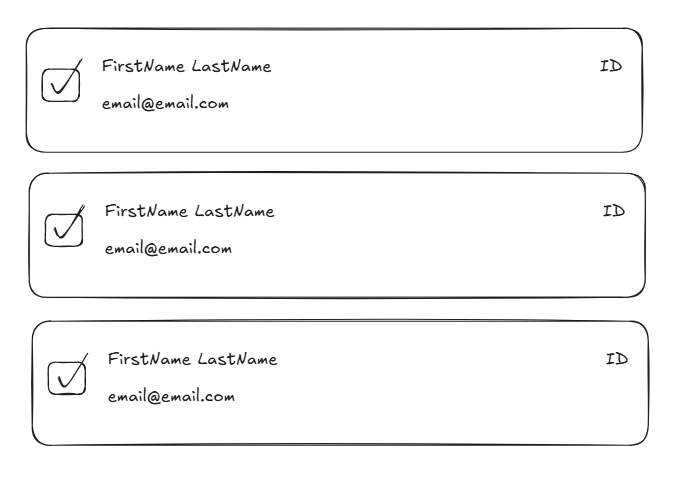

# CMSPI Frontend Technical Challenge

Welcome to the CMSPI Web developer techical challenge.

## Before You Begin

- **You are not expected to fully complete this challenge.** Work at a pace that is comfortable to you.
- **Feel free to look up anything you need** while working on this test.
- **Please disable any AI code generation tools** (such as GitHub Copilot or Claude) during this challenge.

This project currently uses standard CSS. However, if you're more comfortable with a styling framework like TailwindCSS, Chakra UI, or similar, feel free to refactor and use what works best for you.

Where appropriate, please consider performance, optimization, and testability.

## The Task

Your task is to implement a new `UserDirectory` component that displays a vertically listed directory of users.

> Your team has agreed that styling is not a top priority at this stage. Basic, readable styling is all that’s required. A simple reference sketch has been provided to help guide layout and structure:

### Step 1: Build the UserDirectory Component

- Create a new component named `UserDirectory` with the following props:
  - `userData` (required): An array of user objects, sourced from ./src/mock/data.json. _This has been gathered for you within `App.tsx`_
  - `onUserSelect` (optional): A callback function that fires when a user is selected.
- Use this component in `App.tsx`, replacing the existing placeholder comment.
- Implement the component, so that all the users render correctly.
  - As per the reference, each user entry in the list should display the following fields:
    - `id`
    - `firstName`
    - `lastName`
    - `email`
- Each user should be selectable.

### Step 2: Add a Search Bar

- Enhance the `UserDirectory` component with a search bar positioned above the list.
- This search feature should filter the displayed users based on a partial match of either the:
  - `firstName`
  - `lastName`
  - `email`.
- Additionally, the matched portion of the text within the results should be highlighted for better visibility.
